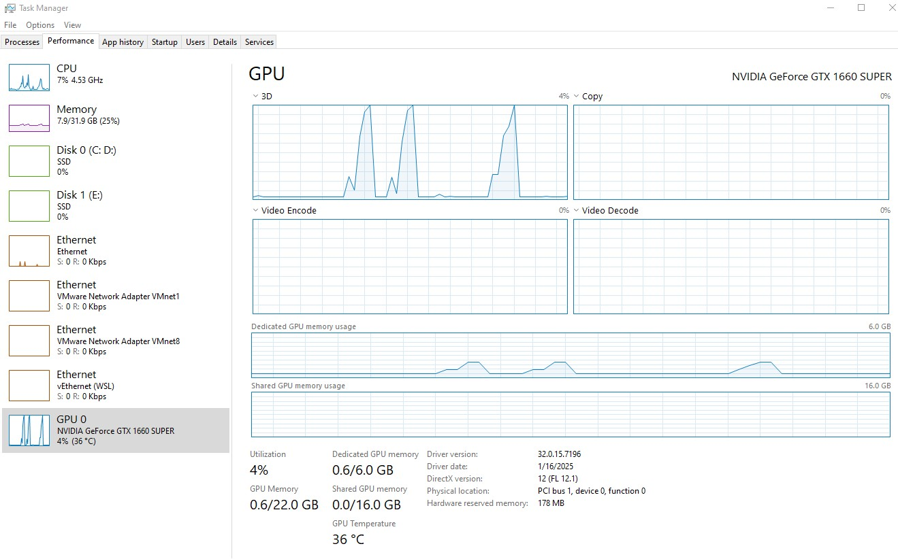
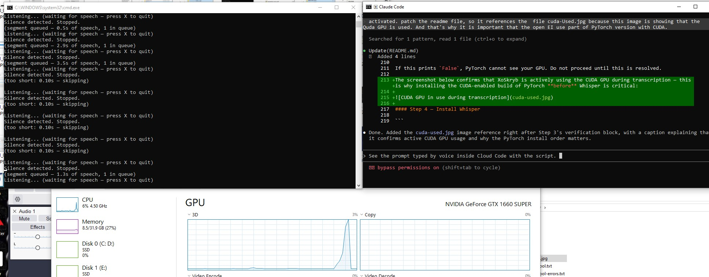

# XoSkryb

> *"The scribe who was silent became the scribe who was heard."*

**XoSkryb** is the AI-powered next generation scribe — a tribute to the ancient Egyptian scribes who were the keepers of knowledge, the voice of pharaohs, and the memory of civilizations. Where the Egyptian scribe sat cross-legged with reed and papyrus, XoSkryb sits silently in your system, listening, and writes your words into any application on your screen — instantly, continuously, and without interruption.

You speak. It writes. You focus on your thoughts.

---

## Design

Designed and architected by **Thierry Brémard**.

---

## Platform

**Current version: Windows only** (keyboard injection).

XoSkryb relies on the native Windows `SendInput` API (`user32.dll`) with `KEYEVENTF_UNICODE` keyboard
events to inject transcribed text directly into the operating system's input stream. This is not a
clipboard trick — every character is delivered as a genuine hardware-level keystroke to whichever
window holds keyboard focus at that moment. This mechanism is intrinsic to the Windows kernel input
model and is not available on other operating systems without a dedicated implementation.

The audio capture pipeline (`sounddevice`, `soundfile`, `numpy`) and the Whisper transcription engine
are fully cross-platform. Only the **keyboard injection layer** is platform-specific. The code already
contains a platform switch (`sys.platform`) with clearly documented stubs for macOS and Linux,
making it straightforward to add support for other systems.

### Contributing — macOS and Linux Support

Contributions adding keyboard injection for **macOS** or **Linux** are warmly welcome.

The relevant stub functions are located at the top of `XoSkryb.py`, inside the platform switch block.
The comments in the stubs describe the recommended APIs for each platform:

| Platform | Suggested API | Package |
|---|---|---|
| macOS | `CGEventCreateKeyboardEvent` + `CGEventKeyboardSetUnicodeString` | `pyobjc-framework-Quartz` |
| Linux (X11) | `xtest_fake_input` with `XStringToKeysym` | `python-xlib` |
| Linux (Wayland) | `UInput` with `EV_KEY` events | `python-evdev` |

To contribute, implement `type_text(text)` and `poll_command()` inside the
appropriate platform blocks in `keyboard_controller.py` and open a pull request.

---

## How It Works — Technical Architecture

XoSkryb is built around a **dual-thread pipeline** that keeps the microphone permanently active and never blocks speech capture while transcription is running.

### Thread 1 — Audio Capture (Main Thread)

The main thread runs an infinite listening loop powered by `sounddevice.InputStream`, streaming raw audio from the microphone in 100 ms chunks. Each chunk is analyzed in real time using **RMS amplitude** (Root Mean Square), a measure of the energy level of the audio signal.

The capture follows a strict state machine with **speech onset confirmation**:

```
Phase 1 ── WAITING
  │   Microphone is open. Audio is streamed but discarded.
  │   RMS is measured on every chunk.
  │   As long as RMS < SILENCE_THRESHOLD → stay in WAITING.
  │   As soon as RMS ≥ SILENCE_THRESHOLD → enter confirmation.
  │
  └──► Phase 2 ── CONFIRMING
  │      Consecutive loud chunks are counted.
  │      If ONSET_CONFIRM_CHUNKS (3) consecutive loud chunks are seen
  │      → speech confirmed → transition to RECORDING.
  │      If any chunk is silent during confirmation
  │      → noise spike → reset to WAITING (buffer cleared).
  │
  └──► Phase 3 ── RECORDING
         Audio chunks are accumulated into a memory buffer.
         RMS is still measured on every chunk.
         When RMS < SILENCE_THRESHOLD for ≥ SILENCE_DURATION (1 s)
         → silence detected → recording stops.
         The buffer is saved as a temporary WAV file.
         The WAV path is pushed onto the transcription queue.
         Immediately return to Phase 1.
```

The confirmation phase prevents isolated noise spikes (keyboard clicks, mouse taps) from
triggering a recording. Only sustained sound that lasts at least 3 consecutive chunks (300 ms)
is accepted as speech onset.

The main thread **never waits for transcription** — it returns to listening the instant a segment is
queued. This means you can start speaking a new sentence while the previous one is still being
processed. Crucially, **the microphone is always open**. XoSkryb never stops listening. If you do
not speak, nothing is recorded and nothing is typed — silence costs nothing. The moment you speak,
the pipeline activates.

### Thread 2 — Transcription Worker (Background Daemon Thread)

A dedicated daemon thread runs permanently in the background, waiting on the transcription queue. Whenever a WAV file path appears in the queue, the worker:

1. Calls **OpenAI Whisper** directly via the Python API — no subprocess, no per-segment startup cost:
   ```python
   result = model.transcribe(segment_wav, language=language)
   transcript = result["text"].strip()
   ```
   The Whisper model is loaded **once** at startup with `device="cuda"` (falls back to `"cpu"` automatically if no GPU is available), then reused for every segment.
2. Whisper processes the audio segment using its neural network model (GPU-accelerated via CUDA when available) and returns the transcript directly in memory.
3. The worker injects each character into the active window using the Windows `SendInput` API — one Unicode key-down and key-up event per character, sent as a single batched `SendInput` call for efficiency.
4. The temporary WAV file is deleted after typing.
5. The worker immediately waits for the next item in the queue.

### Transcription Queue

The queue between the two threads is unbounded. If you speak faster than Whisper can transcribe (e.g. several short sentences in quick succession), segments accumulate in the queue and are processed in order, one by one. No audio is ever lost — every segment recorded will eventually be transcribed and typed.

### Why Pause Between Sentences?

Whisper is a **segment-based** transcription model. It transcribes a fixed audio clip from start to finish — it does not stream word by word. XoSkryb uses natural pauses in your speech as the trigger to close a recording segment and send it for transcription. **A pause of approximately 1 second** (configurable via `SILENCE_DURATION`) signals the end of a sentence and flushes it to the transcription queue.

- A short pause → sentence is flushed → Whisper transcribes → text is typed
- No pause → recording continues accumulating → nothing is typed yet

This is by design. Speaking in natural sentence-length bursts with brief pauses between them gives the best transcription quality and the most responsive output.

---

## Always On — XoSkryb Runs Silently in the Background

Once launched, XoSkryb **runs continuously and indefinitely**. There is no record button, no push-to-talk, no mode to activate. The program simply waits, always listening, always ready. It has no opinion about whether you should speak or not — that decision belongs entirely to you.

You can **pause** listening at any time by pressing **Space** in the console. While paused, the microphone is closed and no audio is captured. Press **Space** again to resume. This is useful when you need to have a conversation without XoSkryb transcribing it, or when you want to temporarily silence the tool without quitting.

> **If you do not speak, XoSkryb does nothing.**
> If you speak, your words are transcribed and typed.
> The initiative is always yours.

This design is intentional. XoSkryb is a passive tool. It does not interrupt, it does not prompt, it does not time out. You can stay silent for hours and it will wait patiently. The moment you choose to speak, it is ready.

### The Python Window Does Not Need to Be in Focus

This is one of XoSkryb's most important practical qualities: **the Python console window can be
minimised, moved to the background, or placed behind other applications — and the tool keeps
working perfectly.**

This works because XoSkryb uses the Windows `SendInput` API to inject keystrokes directly into the
operating system's input queue, addressed to whichever window currently holds keyboard focus. The
Python process that runs XoSkryb is completely separate from the window that receives the typed
text. XoSkryb does not need to be the active window — it only needs to be running.

A typical real-world session looks like this:

1. Launch `python XoSkryb.py` in a terminal
2. Minimise the terminal window — XoSkryb continues running in the background
3. Open your target application (chat, document, email, code editor, etc.)
4. Click inside the text field where you want your words to appear
5. Speak naturally — your words are typed directly into that field, as if by an invisible hand

The Python console remains in the background the entire time. You never need to interact with it
again until you want to pause (**Space**) or quit (**X** or **Ctrl+C**).

## User Responsibility — Window Focus

XoSkryb types into **whatever window has keyboard focus at the moment transcription completes**. It
has no knowledge of your screen layout, open applications, or cursor position.

> **You are responsible for placing focus in the correct window before speaking.**

If the focus shifts to another window between speaking and transcription completing, the text will
be typed into that other window instead. This is intentional — it gives you full, transparent
control over where the output lands. XoSkryb types where you tell it to by virtue of where you
click.

### The Scribe and the Pharaoh — a matter of privilege

In ancient Egypt, a scribe served the court — but even the most talented scribe could not simply
walk into the Pharaoh's throne room and start writing on the royal scrolls. To write in the
Pharaoh's chambers, the scribe had to be **granted the same rank**.

Windows works the same way. When an application runs as **Administrator** (the Pharaoh), it sits
in an elevated throne room protected by **UIPI** (User Interface Privilege Isolation). A humble
scribe running at normal privilege is not allowed to send keystrokes into the Pharaoh's window —
Windows silently discards them. No error, no warning. The scribe writes, but the ink never reaches
the papyrus.

The solution is as old as the pyramids: **elevate the scribe to the rank of the Pharaoh**.

```
# Right-click your terminal → "Run as administrator", then:
python XoSkryb.py
```

> **Rule of thumb:** if XoSkryb's words do not appear, the Pharaoh is running as Administrator.
> Promote the scribe to Administrator as well, and order shall be restored.

---

## Requirements

### Python Version

**Python 3.10** is recommended. It is the version XoSkryb was developed and tested with, and it
provides the best compatibility with the Whisper and PyTorch ecosystems at the time of writing.
Python 3.11 and 3.12 are generally compatible, but some PyTorch CUDA builds may lag behind the
latest Python releases. When in doubt, use Python 3.10.

### OpenAI Whisper with CUDA Support

XoSkryb requires **OpenAI Whisper** installed and accessible from the command line. Whisper is the
neural network engine that performs all speech recognition.

> **Important**: to benefit from GPU acceleration, PyTorch **must be installed with a CUDA-compatible
> build before Whisper is installed**. If you install Whisper first and let it pull a CPU-only PyTorch
> automatically, Whisper will silently fall back to CPU even when `--device cuda` is specified.

#### Step 1 — Check your CUDA version

Open a terminal and run:

```
nvidia-smi
```

Look for the `CUDA Version` field in the top-right corner of the output (e.g. `12.1`, `11.8`).
This is the maximum CUDA version your driver supports.

#### Step 2 — Install PyTorch with the matching CUDA build

Go to https://pytorch.org/get-started/locally/ and select your OS, Python version, and CUDA version
to get the exact install command. Common examples:

```
# CUDA 12.1
pip install torch torchvision torchaudio --index-url https://download.pytorch.org/whl/cu121

# CUDA 11.8
pip install torch torchvision torchaudio --index-url https://download.pytorch.org/whl/cu118
```

#### Step 3 — Verify GPU is visible to PyTorch

```
python -c "import torch; print(torch.cuda.is_available(), torch.cuda.get_device_name(0))"
```

Expected output (example):

```
True    NVIDIA GeForce GTX 1660
```

If this prints `False`, PyTorch cannot see your GPU. Do not proceed until this is resolved.

The screenshot below confirms that XoSkryb is actively using the CUDA GPU during transcription — this is why installing the CUDA-enabled build of PyTorch **before** Whisper is critical:



#### Step 4 — Install Whisper

```
pip install openai-whisper
```

Because PyTorch with CUDA is already installed, Whisper will use it automatically.
XoSkryb loads the model with `device="cuda"` at startup — no flag needed, CUDA is detected automatically via `torch.cuda.is_available()`.

Full Whisper installation guide: https://github.com/openai/whisper

#### Expected Performance

On an **NVIDIA GeForce GTX 1660** paired with an **Intel Core i7** processor, using the `small`
Whisper model, transcription of a typical 3–5 second speech segment takes approximately
**1 to 2 seconds**. This is well within the dual-thread pipeline's tolerance — recording of the
next sentence begins immediately while the previous one is being transcribed, so no speech is lost.

On CPU-only systems, transcription of the same segment may take 10–30 seconds or more, causing
the queue to back up significantly during sustained dictation. CPU usage is not recommended for
real-time dictation.

### Python Packages

```
pip install sounddevice soundfile numpy
```

---

## Configuration Files

| File | Purpose |
|---|---|
| `XoSkryb.config` | Saved microphone device index and language. Delete to reconfigure. |
| `XoSkryb.languages` | List of all Whisper-supported languages. Uncomment to enable. |

---

## Usage

### Live Dictation

```
python XoSkryb.py
```

**First run** — you will be prompted once to configure:
1. **Microphone device** — all input devices are listed with duplicates removed. The selected device is validated by opening a test stream before being accepted.
2. **Language** — only languages enabled in `XoSkryb.languages` are shown. English, French, German, Spanish, and Portuguese are enabled by default.

Selections are saved to `XoSkryb.config` and reused on every subsequent run.

**While running:**

| Event | Behaviour |
|---|---|
| Silence | Microphone is open and listening — no audio is captured or stored |
| Speech detected | Recording begins immediately, RMS-gated |
| Pause ≥ 1 second | Segment is closed, queued for transcription, listening resumes |
| Transcription complete | Text is typed into the focused window character by character |
| New speech during transcription | Captured normally — nothing is missed |
| Press **Space** | Pause listening — microphone is closed, no audio captured |
| Press **Space** (while paused) | Resume listening |
| Press **X** | Graceful shutdown — finishes all pending transcriptions before exiting |
| Press **Ctrl+C** | Immediate shutdown signal — pending transcriptions are still flushed |



### One-Shot File Transcription

```
python transcribe.py <audio_file>
```

Transcribes a single audio file and saves the result as `.txt` in the `Transcripts/` folder. Useful for testing your Whisper installation and microphone recordings.

```
python transcribe.py test.mp3
```

### Language Configuration

Open `XoSkryb.languages` and remove the `#` from any language to add it to the selection menu. The order in the file is the order displayed on screen.

```
# Russian        ← disabled
French           ← enabled
# Japanese       ← disabled
```

---

## Post-Recording Energy Filter

After each recording segment is captured and before it is sent to Whisper, XoSkryb runs a **post-recording energy check** to reject noise-only segments. This avoids wasting GPU time on keyboard clicks, mouse taps, or other non-speech sounds.

### How it works

The recorded audio is split into 100 ms chunks and the RMS (Root Mean Square) energy of each chunk is computed. The **median (p50)** of these chunk RMS values is compared against a threshold.

| Constant | Default | Purpose |
|---|---|---|
| `POST_RMS_THRESHOLD` | `0.05` | Median chunk RMS below this = noise, skip transcription |
| `POST_RMS_WINDOW` | `0.1` s | Chunk size for per-window RMS calculation (100 ms) |
| `POST_RMS_PERCENTILE` | `50` | Percentile used (50 = median) |

### Why median, not mean or p90?

Spiky noise (keyboard typing, clicks) produces short loud bursts separated by silence. The **mean** RMS gets diluted by silence, making noise and speech hard to distinguish. The **p90** catches the spikes, so noise can actually score *higher* than speech. The **median** measures *sustained* energy — speech fills most chunks with energy (high median), while spiky noise has mostly quiet chunks between bursts (low median).

Typical values observed during testing:

| Metric | Speech | Noise |
|---|---|---|
| p50 (median) | 0.07–0.08 | 0.02–0.03 |
| chunks >= 0.05 | ~70 % | ~30 % |
| chunks >= 0.03 | ~80 % | ~45 % |

The trailing silence at the end of each recording (caused by `SILENCE_DURATION`) is trimmed before the energy check so it does not dilute the measurement.

### Troubleshooting mode

Set `TROUBLESHOOT = True` in `XoSkryb.py` to enable diagnostic output. In this mode:

- Every recorded segment is saved as `recordings/diag_HHMMSS_X.Xs.wav` (not deleted)
- Detailed per-segment energy stats are printed: min, mean, std, max, p50, p75, p90
- Transcribed WAV files are also kept for inspection

Set back to `False` for normal use.

### Audio diagnostic tool

A standalone script `audio_stat.py` is provided to analyse saved WAV files:

```
python audio_stat.py <path_to_wav_file>
```

It prints the full RMS timeline, percentiles, stats, and a speech-vs-noise verdict based on the key differentiators. Useful for tuning the energy thresholds for your specific microphone and environment.

---

## Project Structure

```
XoScriber/
├── XoSkryb.py              # Main application — live dictation engine
├── keyboard_controller.py  # Keyboard injection + command polling (Command enum)
├── settings.py             # Settings persistence (device index, language)
├── transcribe.py           # Standalone file transcription utility
├── audio_stat.py           # WAV energy diagnostic tool (speech vs noise analysis)
├── XoSkryb.languages       # Language menu configuration
├── XoSkryb.config          # Saved device and language settings (auto-generated)
├── recordings/             # Temporary WAV segments (auto-deleted after transcription)
└── Transcripts/            # Whisper output files (auto-deleted after typing)
```

---

## Tips for Best Results

- **Speak in complete sentences** and pause naturally at the end. A 1-second pause triggers transcription.
- **Speak fluently and avoid long pauses** within a sentence — long mid-sentence silences can cause premature segment cuts or lower the energy metrics that distinguish speech from noise.
- **Keep sentences reasonably short** — shorter segments transcribe faster, reducing queue buildup.
- **Use a directional microphone** or headset to minimise ambient noise and keyboard sound pickup.
- **Set window focus before speaking** — click your target text field first.
- If keyboard typing noise triggers recording, increase `SILENCE_THRESHOLD` in `XoSkryb.py` (default `0.02`).
- GPU (CUDA) acceleration is highly recommended. With a modern GPU, transcription of a 5-second segment typically completes in under 2 seconds.

---

## A Note on How This Project Was Built

> *50% of the prompts that shaped this code were handcrafted by the author.*
> *The remaining 50% were dictated by voice — using XoSkryb itself.*

The tool was used to build itself. Every instruction, correction, and refinement spoken into the
microphone was transcribed by XoSkryb and typed directly into the development session — a fitting
proof of concept for a scribe that writes what you speak.
